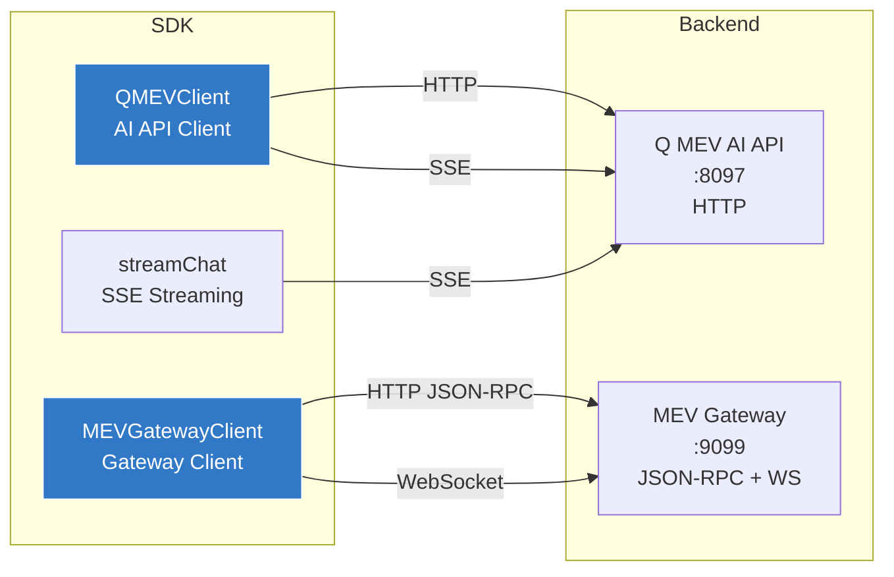

# @yoorquezt/sdk-mev

> TypeScript SDK for YoorQuezt MEV Infrastructure

[](https://www.typescriptlang.org/)
[](https://www.npmjs.com/package/@yoorquezt/sdk-mev)
[](LICENSE)

## Overview

Full-featured TypeScript client for the Q MEV AI API and MEV Gateway. Supports HTTP for chat and tool queries, WebSocket for real-time MEV event subscriptions, and SSE for streaming responses. Ships with complete type definitions for all MEV domain objects.



## Installation

```bash
npm install @yoorquezt/sdk-mev
```

## Quick Start

### Chat with Q

```typescript
import { QMEVClient } from '@yoorquezt/sdk-mev';

const client = new QMEVClient({
  apiUrl: 'http://localhost:8097',
  apiKey: 'yqz_mev_...',
  role: 'searcher',
});

// Simple chat
const response = await client.chat('What arb opportunities exist for WETH/USDC?');
console.log(response.message);
console.log('Tools used:', response.toolsCalled);

// Multi-turn conversation
const followUp = await client.chat(
  'Simulate the top opportunity',
  response.conversationId,
);
```

### Stream Responses

```typescript
const response = await client.chatStream(
  'Analyze the current mempool for MEV',
  (token) => process.stdout.write(token),
);
```

### MEV Gateway Operations

```typescript
import { MEVGatewayClient } from '@yoorquezt/sdk-mev';

const gateway = new MEVGatewayClient({
  url: 'http://localhost:9099',
  apiKey: 'yqz_gw_...',
});

// Submit a bundle
const bundleId = await gateway.submitBundle({
  transactions: ['0xsigned_tx_1...', '0xsigned_tx_2...'],
  blockNumber: 19500000,
});

// Check bundle status
const status = await gateway.getBundleStatus(bundleId);
console.log(status.status); // 'pending' | 'included' | 'failed' | 'expired'

// Simulate before submitting
const sim = await gateway.simulateBundle({
  transactions: ['0xsigned_tx...'],
  blockNumber: 19500000,
});
console.log(`Profit: ${sim.profit}, Gas: ${sim.gasUsed}`);

// Get auction state
const auction = await gateway.getAuction();

// Get relay statistics
const relays = await gateway.getRelayStats();

// Get OFA stats
const ofa = await gateway.getOFAStats('24h');

// Profit history
const profits = await gateway.getProfitHistory('7d', 'arbitrage');
```

### Real-Time Subscriptions

```typescript
// Subscribe to MEV events via WebSocket
const unsubscribe = gateway.subscribe(
  ['bundle_landed', 'sandwich_blocked', 'arb_found', 'relay_down'],
  (event) => {
    console.log(`[${event.severity}] ${event.type}:`, event.data);
  },
);

// Later: unsubscribe and disconnect
unsubscribe();
gateway.disconnect();
```

## API Reference

### QMEVClient

Client for the Q MEV AI API (natural language + tools).

| Method | Signature | Description |
|--------|-----------|-------------|
| `chat` | `chat(message, conversationId?, context?): Promise<ChatResponse>` | Send a chat message and receive a complete response |
| `chatStream` | `chatStream(message, onToken, conversationId?): Promise<ChatResponse>` | Stream a chat response token by token via SSE |
| `listTools` | `listTools(): Promise<QMEVTool[]>` | List all available MEV tools for the configured role |
| `health` | `health(): Promise<EngineHealth>` | Get current engine health status |

### MEVGatewayClient

Client for the MEV Gateway (JSON-RPC + WebSocket).

| Method | Signature | Description |
|--------|-----------|-------------|
| `submitBundle` | `submitBundle(bundle): Promise<string>` | Submit a bundle, returns bundle ID |
| `getBundleStatus` | `getBundleStatus(bundleId): Promise<BundleStatus>` | Get bundle status |
| `simulateBundle` | `simulateBundle(bundle): Promise<SimulationResult>` | Simulate bundle execution |
| `getAuction` | `getAuction(blockNumber?): Promise<Auction>` | Get current auction state |
| `getMempoolSnapshot` | `getMempoolSnapshot(): Promise<MempoolSnapshot>` | Get mempool snapshot |
| `getRelayStats` | `getRelayStats(relayId?): Promise<RelayStats[]>` | Get relay statistics |
| `getOFAStats` | `getOFAStats(timeRange?): Promise<OFAStats>` | Get OFA statistics |
| `getProfitHistory` | `getProfitHistory(timeRange?, strategy?): Promise<ProfitHistory>` | Get profit history |
| `subscribe` | `subscribe(topics, onEvent): () => void` | Subscribe to MEV events via WebSocket |
| `call` | `call<T>(method, params?): Promise<T>` | Raw JSON-RPC call |
| `disconnect` | `disconnect(): void` | Close all connections |

## Key Types

```typescript
interface Bundle {
  transactions: string[];       // Signed tx hex strings
  blockNumber?: number;         // Target block
  minTimestamp?: number;        // Min inclusion time
  maxTimestamp?: number;        // Max inclusion time
  revertingTxHashes?: string[]; // Allowed-to-revert txs
}

interface BundleStatus {
  bundleId: string;
  status: 'pending' | 'included' | 'failed' | 'expired';
  blockNumber?: number;
  txHash?: string;
  profit?: string;
}

interface SimulationResult {
  success: boolean;
  gasUsed: number;
  profit: string;              // In wei
  revertReason?: string;
  logs: Array<{ address: string; topics: string[]; data: string }>;
}

interface MEVEvent {
  type: string;                // 'bundle_landed', 'sandwich_blocked', etc.
  severity: 'info' | 'warning' | 'critical';
  data: Record<string, unknown>;
  timestamp: number;
}

type MEVRole = 'searcher' | 'builder' | 'validator' | 'operator' | 'analyst';
```

## Error Handling

```typescript
import { QMEVError } from '@yoorquezt/sdk-mev';

try {
  await gateway.submitBundle(bundle);
} catch (err) {
  if (err instanceof QMEVError) {
    switch (err.code) {
      case 'AUTH_ERROR':    // Invalid API key
      case 'NETWORK_ERROR': // Connection failed
      case 'HTTP_ERROR':    // Non-200 response
      case 'RPC_ERROR':     // JSON-RPC error from gateway
      case 'WS_DISCONNECTED': // WebSocket closed
    }
  }
}
```

## Testing

The SDK includes 89 tests across 5 test suites:

| Suite | Description |
|-------|-------------|
| `client` | QMEVClient HTTP interactions, chat, tool listing, health checks |
| `gateway` | MEVGatewayClient JSON-RPC calls, bundle submission, simulation |
| `errors` | QMEVError construction, error codes, serialization |
| `streaming` | SSE streaming, token-by-token chat responses |
| `utils` | Utility functions, parameter validation, type guards |

```bash
# Run all tests
npm test

# Verbose output with individual test names
npx jest --verbose

# Generate coverage report
npx jest --coverage
```

## Development

```bash
npm install
npm run build       # Compile TypeScript
npm run test        # Jest tests
npm run lint        # ESLint
```
